# 教室で使えるかもしれないもの作り #◯ 「早く終わった子」の5分が変わる。1台を2人で囲む3Dボードゲーム「GIGAクアルト！」

## 🏫 はじめに

テストやプリントが早く終わった子に、「読書していてね」と言うしかない5分。
雨の日の休み時間、教室でもてあましてしまう時間。
次の準備をしているあいだ、手持ちぶさたにさせてしまう数分間。
そういう時間に、何かちょうどいいものはないかと探したことはありませんか。

ドリルの残りをやらせるのは、たぶん違うのだと思います。
かといって自由帳を出させると、しばらく戻ってこられなくなる子もいます。
準備がいらなくて、ルールがすぐ分かって、それでいて頭は使う。
そんな都合のいいものがあればいいのに、とずっと思っていました。

思い当たったのが、ボードゲームでした。
ルールが短くて、勝ち負けがはっきりしていて、数分で一区切りがつくもの。
ただ、教室で使おうとすると現実的な問題がいくつも出てきます。
班の数だけそろえるのは大変ですし、小さなコマは必ずどこかへ消えます。
出すのと片づけるのに、遊ぶ時間と同じくらいかかることもあります。
「じゃあ画面の中でやればいい」と思ったのが、作りはじめたきっかけです。

そこで作ったのが「GIGAクアルト！」です。

https://quarto.giga-school.com/

ボードゲームの「クアルト！」を、ブラウザで開くだけで遊べるようにしたものです。
たて4つ、よこ4つの16マスに、16個のコマを交互に置いていきます。
ログインも名前の入力もありません。開いたらもう始まっています。

そして、このゲームにはひとつだけ変わったきまりがあります。
自分が置くコマは、自分では選べません。相手が選んで渡してきます。
たったそれだけのことで、子どもたちは相手の頭のなかを想像しはじめます。

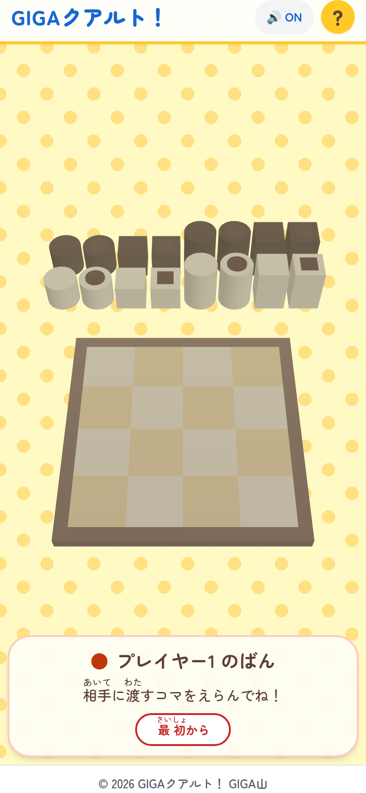

開いてすぐの画面です。まん中に盤面、その奥に16個のコマが並んでいます。

## 📱 このアプリでできること

コマは16個あって、同じものはひとつもありません。
白か黒、丸か四角、高いか低い、上に穴があるかないか。
この四つの組み合わせを全部つくると、ちょうど16個になります。

たて、よこ、ななめ。そろえられる線は全部で10本あります。
そのどれか1本で、四つのうちどれかひとつの共通点がそろったら勝ちです。
色でも、形でも、高さでも、穴でもかまいません。ひとつそろえば勝ちです。

はじめて見る子には、右上の「？」を押すと出てくる4枚の絵が近道になります。
説明を読ませるのではなく、丸と四角、白と黒を並べて見せるだけにしました。
文字で読むより、絵で見たほうが早いだろうと思ったからです。

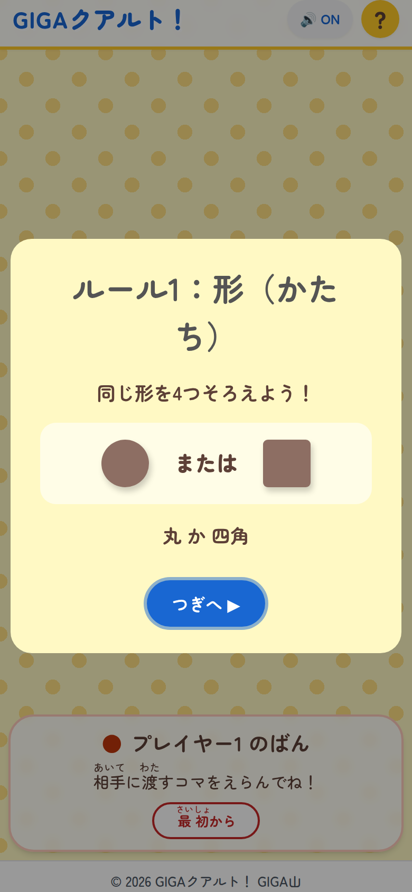

形のきまり。丸か四角です。

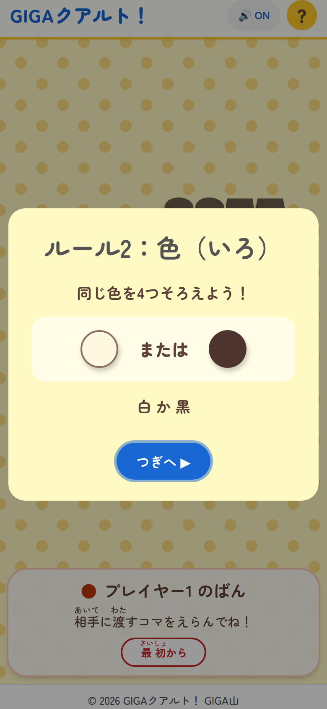

色のきまり。白か黒です。

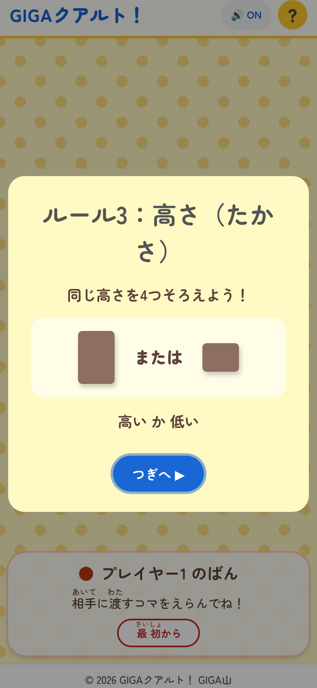

高さのきまり。高いか低いかです。

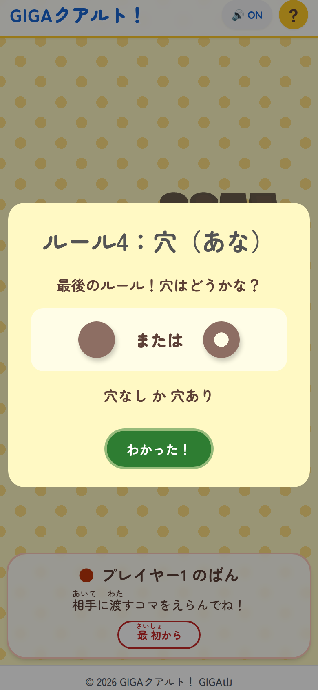

最後は穴のきまり。上に穴があるかないかです。この4枚で説明はおしまいです。

盤面を3Dにしたのには理由があります。
色と形だけなら、真上から見た絵でも十分に伝わります。
けれど高さと穴は、平らな絵にした瞬間に分からなくなってしまいます。
高いコマと低いコマが同じ大きさの丸に見えてしまうと、四つのうち二つが使えなくなります。
斜めから見て、背の高さがひと目で分かる形にしたかったので、立体にしました。

1本指でなぞると、盤面はぐるりと回ります。
2本指でつまめば、近づけたり遠ざけたりもできます。
高いコマの向こうが見えないときは、少し回してのぞきこめばいい。
紙のボードゲームで、子どもたちが自然にやっていることと同じです。

コマを選ぶときと置くときは、その場でぽんと押します。
指を置いたところから10ピクセル以内、0.6秒以内に離すと「押した」になります。
少し動かしたり長く押しすぎたりすると、盤面を回す操作として扱われます。
回そうとしただけなのにコマが動いてしまう、という事故を減らすための線引きです。

手番が回ってくると、画面のまん中にお知らせが出ます。

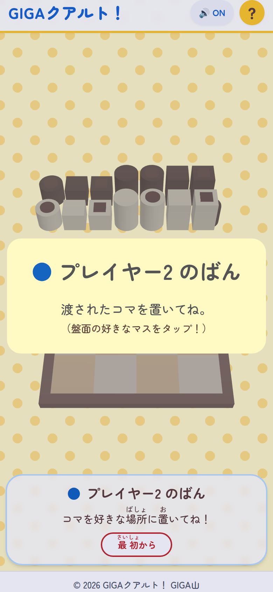

コマを渡された側に、いま何をすればいいのかを一度だけ大きく出します。

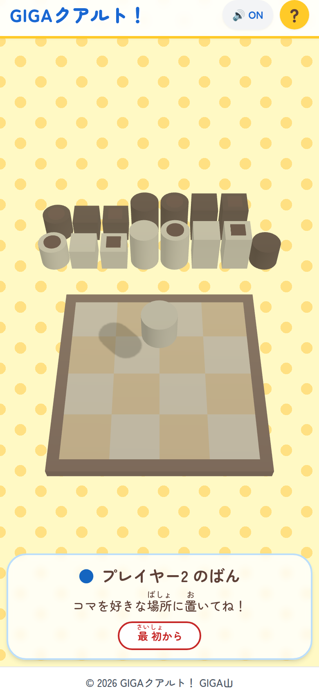

渡されたコマは、盤面のまん中にふわりと浮きます。これを好きなマスに置きます。

画面のいちばん下には、いつも同じ場所に「いま誰の番で、何をするのか」が出ています。
「相手に渡すコマをえらんでね！」なのか、「コマを好きな場所に置いてね！」なのか。
ここを見れば迷わないように、対局のあいだずっと出しっぱなしにしてあります。

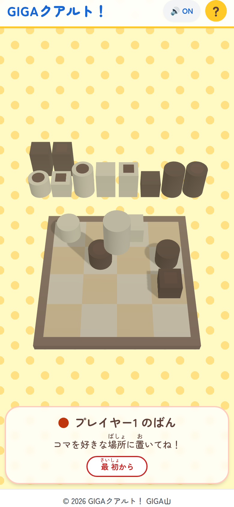

数手進んだところ。置いたコマが増えるにつれて、渡せるコマが減っていきます。

そろった瞬間は、4つのコマが黄色く光ります。

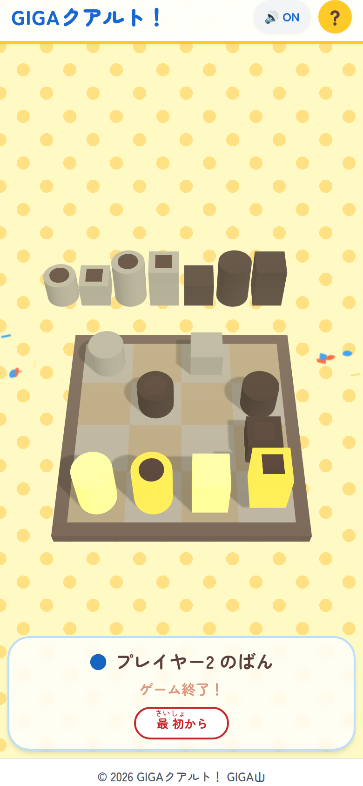

この対局は、下の一列が全部「高いコマ」でそろって決まりました。
色も形もばらばらですが、高さだけがそろっています。

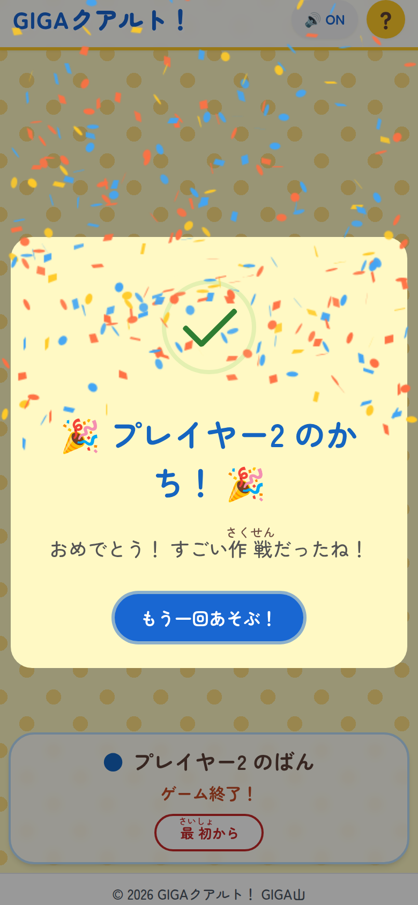

紙吹雪といっしょに「かち！」が出ます。「もう一回あそぶ！」を押せば、すぐ次が始まります。

16個すべてを置いてもどこにもそろわなかったときは、引き分けになります。
こちらも閉じればそのまま次の対局です。区切りをつけるための操作はいりません。

途中でやめたくなったときは、下の「最初から」を押します。
まちがえて押してしまう子がいるので、いちど確認をはさむようにしました。

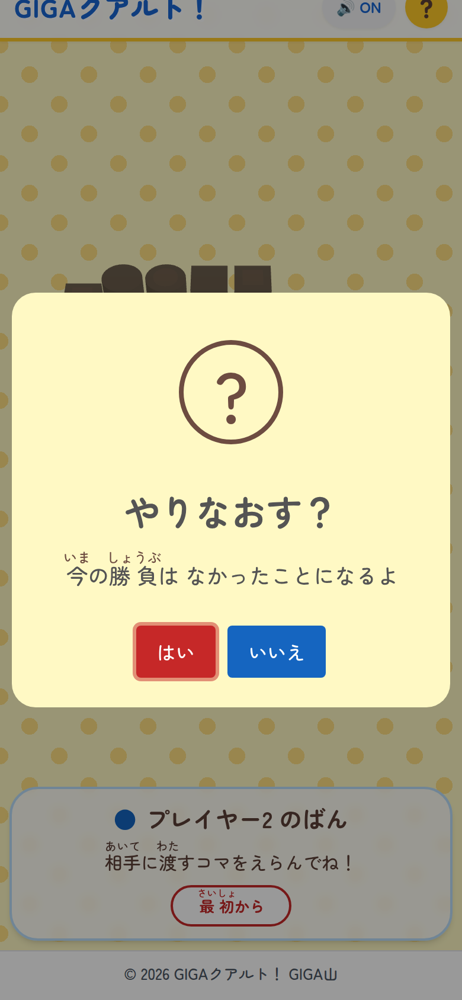

「今の勝負は なかったことになるよ」と伝えてから、はい か いいえ を選んでもらいます。

音が出ると困る場面もあると思います。右上を押せばすぐ消せます。

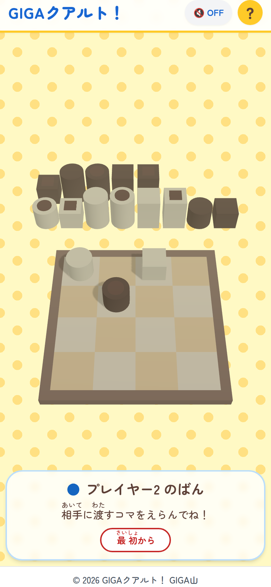

「OFF」に変わっているあいだは何も鳴りません。一斉に使うときはこちらにしてください。

## 🎲 いちばんおもしろいのは、渡すコマを自分が選ぶところ

ふつうの四目ならべなら、自分の駒を自分で置いて、自分で並べます。
このゲームはそこが逆さまです。自分が置くのは、相手が選んで渡してきたコマだけ。
そして自分の番が終わったら、こんどは相手に渡すコマを自分が選びます。

だから、うまく置けたと思ってもまだ半分です。
そのあとに「では、あなたは何を置きますか」と手渡す仕事が残っています。
盤面をもう一度ながめて、渡しても大丈夫なコマを探すことになります。

ここでいちばん起きるのが、うっかり相手を勝たせてしまうことです。
そろえたコマが誰のものかは関係がなく、最後に置いた人が勝ちだからです。
自分で「はい、どうぞ」と勝ちを渡してしまう。この体験がとても効くと思っています。

負けた理由が、運でも反射神経でもなく、自分がよく見なかったことにある。
それが分かると、次の一手の前に子どもたちは必ず盤面を見直します。
「渡す前にもう一度見る」を、注意ではなくゲームのきまりのほうから引き出したい。
そう考えて、このルールをそのまま残しました。

見るところが四つあるのも、この短さのわりに歯ごたえがある理由だと思います。
色をそろえないように気をつけていたら、高さがそろっていた。
形は大丈夫だと確かめたのに、穴のことをすっかり忘れていた。
大人でもふつうに引っかかります。だから先生と子どもが対等に遊べます。

学年に合わせて手加減したいときは、勝ちの条件を口で減らす手があります。
低学年の子と遊ぶなら、「今日は色と形だけね」と決めてしまう。
高さと穴はそろっても勝ちにしない、というだけの取り決めです。
アプリの側にそういう設定は付けていませんが、二人で決めればそれで足ります。
慣れてきたら高さを足して、最後に穴を足す。段階を作るのは大人の仕事だと思っています。
設定の画面を増やすより、その場のやりとりで調整できるほうが早いと考えて、
あえて何も付けませんでした。

コンピュータとの対戦は、あえて入れていません。
このアプリでいちばんおもしろいのは、相手が何を考えているかを読むところだからです。
画面の向こうではなく、机をはさんで向かい合っている人の顔を見てほしい。
1台を2人で囲む形にしたのも、同じ理由です。

## 🖥️ 電子黒板に映して、クラス全員で考える

端末を横に持つと、コマの並び方が変わります。

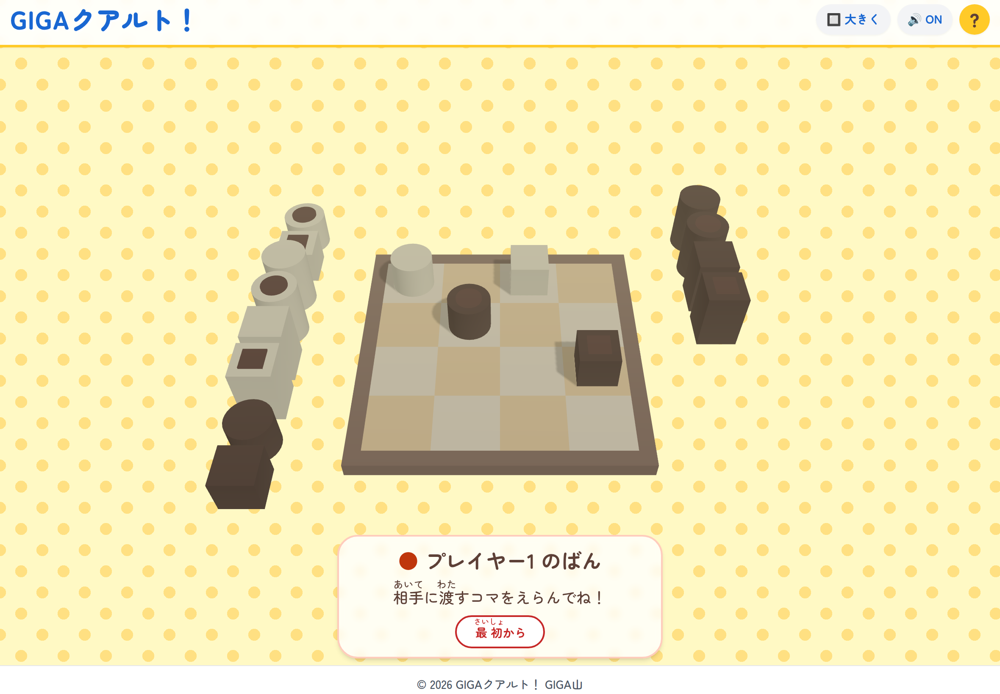

縦に持つと盤面の奥に2列、横に持つと左右に8個ずつ。向きに合わせて自動で切り替わります。

そして画面の広い端末では、右上に「大きく」というボタンが出ます。

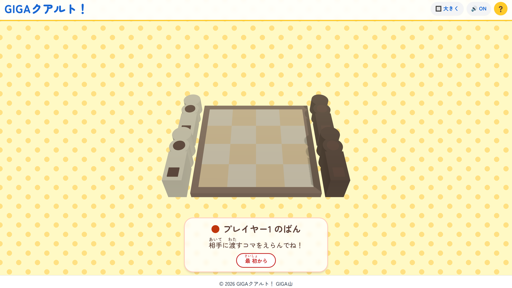

電子黒板につないだところ。押す前はこの見え方です。

これを押すと全画面になり、文字とボタンがひとまわり大きくなります。
教室の後ろの席からも読めることを目安にして、文字を1.5倍にしました。

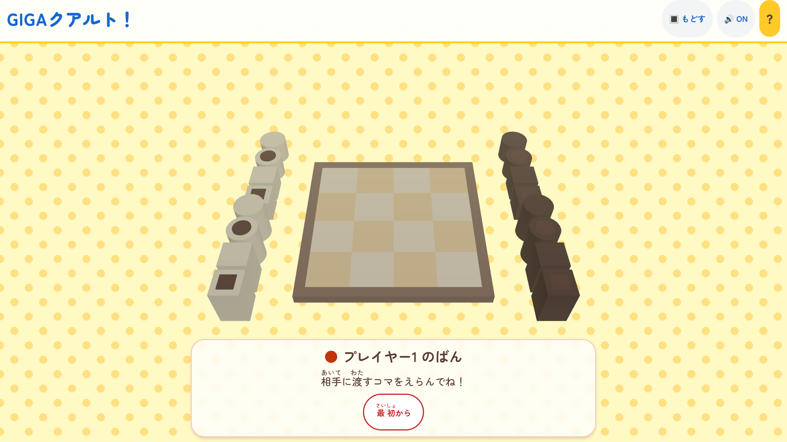

「大きく」を押したあと。文字が大きくなり、下の作者名の帯は消えます。

この状態で「つぎ、どれを渡す？」とクラスに聞く使い方を想像しています。
一手ごとに数人へ理由をたずねていけば、それだけで一時間分の話し合いになりそうです。
勝ち負けを決めなくても、渡すコマを選ぶところだけで考える時間になると思います。

## ✨ 導入のメリット

三つのいいことが期待できます。

一つ目は、思い立ってから使いはじめるまでが短いことです。
アドレスを開くだけで、名前の入力もログインもありません。
アカウントを配る作業も、パスワードを忘れた子の対応もいりません。
「じゃあ2人で1台ね」と言えば、次の1分から遊びはじめられます。
準備に手間がかかるものは、結局その日のうちに使わなくなってしまいます。

二つ目は、記録が残らないぶん、気をつかわずに済むことです。
このアプリは対局の結果を保存しませんし、どこにも送りません。
誰が何回勝ったかも、どの子が使ったかも、どこにも残りません。
共用の端末でも、前に使った子の情報を引き継いでしまう心配がありません。
成績にも評価にも関わらない、ただの5分として置いておけます。

三つ目は、ルールが四つしかないのに考えることが尽きないことです。
中学年でもその場で説明できて、高学年や大人でも普通に負けます。
学年をまたいで同じ土俵に立てるので、たてわり活動や交流にも向くと思います。
早く終わった子どうしで遊ばせておく使い方でも、ただ待たせるよりはずっといいはずです。

## 🛠️ 【管理者向け】導入手順

情報担当の先生に確認されそうなことを、先にまとめておきます。

まず、通信についてです。
このアプリが読みこむものは、すべて次のアドレスの下にあります。

- https://quarto.giga-school.com/

校内のフィルタリングで許可が必要なのは、ここだけです。
このほかに、字の形をきれいに見せるために fonts.googleapis.com と
fonts.gstatic.com を読みにいきますが、これは見た目のためだけのものです。
塞がれていても、端末に入っている書体に置きかわるだけで、遊ぶことに支障はありません。
ゲームを動かすためのしくみは、すべてこのアプリの中に入れてあります。
起動したあとに、外へ何かを送ることは一切ありません。

次に、個人情報についてです。
名前も出席番号も入力しません。カメラもマイクも使いません。
対局の結果は、その端末の中にも残りませんし、外にも送りません。
次に開いたときは、必ずまっさらな盤面から始まります。
共用端末で使う場合も、履歴の消去のような作業はいりません。

三つめに、端末に入れておく方法です。
一度入れておくと、ホーム画面から直接開けるようになり、
一斉に使いはじめたときの待ち時間が短くなります。
このアプリは3Dの盤面を持っているぶん、はじめて開くときだけ読みこみが重めです。
40人が同時に開く場面が想定されるなら、事前に入れておくことをおすすめします。

ChromebookとWindowsの場合の手順です。

1. アプリを開いて、右上に「いれる」というボタンが出ていたら押します
2. 出ていないときは、アドレスバーの右はしにあるインストールのしるしを押します
3. 確認が出たら「インストール」を押します

iPadとiPhoneの場合の手順です。

1. Safariでアプリを開きます
2. 画面の下か上にある共有ボタンを押します
3. メニューを下にたどって「ホーム画面に追加」を押します
4. 右上の「追加」を押します

iPadに「いれる」ボタンは出ません。Safariのしくみ上、上の手順が必要になります。
逆に、画面の狭いスマートフォンには「大きく」ボタンを出していません。
上の帯が折り返して読みにくくなるためで、横幅が広い端末のときだけ出す作りにしています。

四つめに、つながっていないときの動きです。
いちど開いたことがある端末なら、インターネットにつながっていなくても遊べます。
まだ一度も開いていない端末で圏外になっていると、次の画面が出ます。

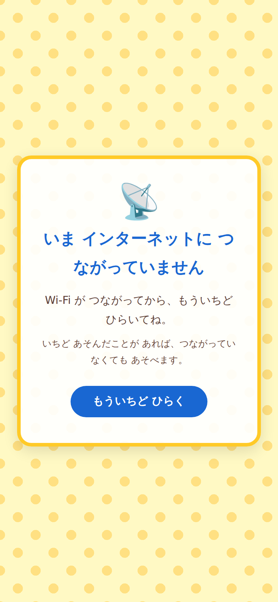

まっ白な画面で止まらないよう、子どもが読める言葉で出しています。

五つめに、更新の扱いです。
新しい版を用意したときは、画面の下に帯が出ます。

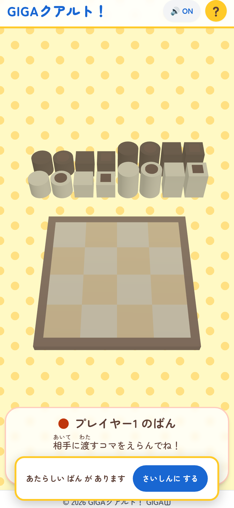

「さいしんに する」を押すまで切り替わりません。対局の途中で盤面が消えることはありません。

六つめに、印刷についてです。
このアプリは紙に印刷して使うものではありません。
まちがえて印刷ボタンを押してしまっても、ボタンや帯は紙に出ないようにしてあります。
学級で一斉に使うときに、うっかり大量に刷ってしまう事故は起きないはずです。

最後に、これはできませんという話をひとつ。
上の帯のボタンや「最初から」はキーボードで選べますが、
盤面のコマを選ぶ操作と置く操作だけは、いまのところ画面を押すしかありません。
マウスやタッチが使いにくい子がいる場合は、そのことを見込んで組み合わせを考えてください。

## 📖 【利用者向け】使い方のガイド

子どもたちに配るときは、次の順で伝えると迷いにくいと思います。

1. 2人で1台の端末を囲んで、画面をはさんで向かい合って座ります
2. アプリを開きます。何も入力せず、そのまま始められます
3. はじめての子がいるときは、右上の「？」を押して4枚の絵を見せます
4. 下の帯に「プレイヤー1 のばん」と出ていることを確かめます
5. プレイヤー1が、相手に渡すコマをひとつ選びます。盤面の外に並んでいるコマをぽんと押します
6. 選んだコマがまん中に浮いて、「プレイヤー2 のばん」と出ます
7. プレイヤー2が、そのコマを好きなマスに置きます。空いているマスをぽんと押します
8. 置いたら、こんどはプレイヤー2が相手に渡すコマを選びます
9. これをくりかえします。たて、よこ、ななめのどれかで共通点が4つそろったら勝ちです
10. もう一度やるときは「もう一回あそぶ！」を押します。途中でやめるときは「最初から」を押します

うまく押せないという声が出たら、たいていは指が動いています。
なぞる動きは盤面を回す操作になるので、その場でぽんと押すように伝えてください。
盤面を回したいときは、指をすべらせます。近づけたいときは2本指でつまみます。

自分の番なのにコマが置けない、という声も出やすいところです。
下の帯が「相手に渡すコマをえらんでね！」のときは、選ぶ番です。
置けるのは「コマを好きな場所に置いてね！」と出ているときだけです。

3人以上で1台を使いたいときは、勝った子が残って挑戦者が交代する形が回しやすいはずです。
見ている子には「次はどれを渡すと思う？」と聞いてみてください。
このゲームは、見ているだけでも考えることがあります。
指す番でなくても頭は動くので、順番待ちが退屈になりにくいと思います。

そして、いちばん大事な声かけをひとつだけ。
はじめる前に「相手に渡すコマを、よく見てから渡してね」と一言つけ加えてください。
これを言わないと、最初の何回かは自分で相手を勝たせて終わってしまいます。
それはそれで良い経験なのですが、二度目からは考えはじめてくれるはずです。

## 📝 まとめ

このアプリは、丸付けを減らすものでも、記録を集めるものでもありません。
子どもたちが机をはさんで向かい合い、相手の考えを想像する5分を作るためのものです。

ICTというと、便利にすること、速くすること、記録することの話になりがちです。
でも、開くだけで始められて、何も残らないものにも役割はあると思っています。
準備に時間がかからないぶん、その時間を子どもたちのほうに向けられます。
先生が横で「そのコマ、渡して大丈夫？」と一言かける余裕も生まれます。

それに、この5分は先生の側にとっても悪くないと思っています。
四つを同時に見なければいけないゲームなので、大人が本気で負けることがあります。
成績にも評価にも関わらない場所で、同じルールの上に並んで座れる。
そういう時間が学級に一つあると、ふだんの声のかけ方まで少し変わる気がします。

「あと5分あるね」が、待つ時間ではなく考える時間になったら。
そう思いながら作りました。
もし教室で試してくださったら、どんな声が出たかを教えていただけるとうれしいです。

一歩踏み出そうとする先生を、私はいつでも全力で応援しています。
